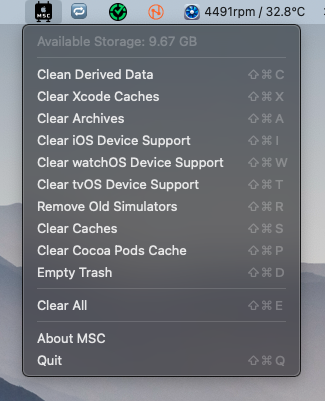

  

<h1 align="center">Mac Space Cleaner</h1>

## 🚀 Overview
Mac Space Cleaner is a lightweight and efficient macOS application designed to help users free up disk space by identifying and removing unnecessary files, caches, and temporary data.

## 🛠 Features
- 🔍 **Scan & Analyze**: Detects junk files, cache, logs, and unnecessary system data.
- 🗑 **One-Click Cleanup**: Remove unwanted files with a single click.
- 🏎 **Performance Boost**: Optimizes storage for a smoother macOS experience.
- 🔒 **Safe Cleaning**: Ensures a safe and secure cleanup process.

## Preview

## 📦 Installation
1. **Download** the latest release from the [GitHub Releases](#) page.
2. Directly open the application folder from the main directory and then move `MacSpaceCleaner.app` to the Applications folder.
3. **Open & Run** the app and grant necessary permissions if prompted.

## 💻 Usage
1. Launch **Mac Space Cleaner**.
2. Click **Scan** to analyze disk usage.
3. Review the identified junk files.
4. Click **Clean** to free up space.

## ⚙️ Requirements
- macOS 12 Monterey or later
- At least 50MB of free disk space

## 🛠 Built With
- Swift (UIKit & AppKit)
- macOS FileManager API
- Sandbox-safe operations

## 🤝 Contributing
We welcome contributions! To contribute:
1. Fork the repository
2. Create a new branch (`feature-branch`)
3. Commit your changes
4. Push to your branch and submit a Pull Request

## 📝 License
This project is licensed under the MIT License - see the [LICENSE](LICENSE) file for details.

## 📬 Contact
For questions or feature requests, reach out at [sanketk.j.2020@gmail.com](mailto:sanketk.j.2020@gmail.com) or open an issue.

## Author
[Sanket Khatri](https://github.com/sanketk2020) 

